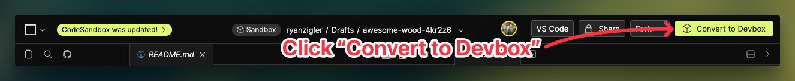
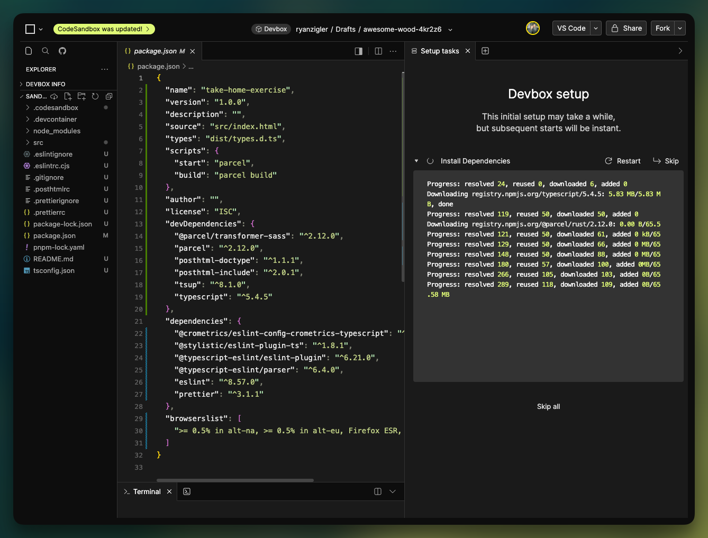
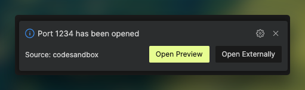

# Cro Metrics Technical Exercise

## Setup

1. Open [https://githubbox.com/CROmetrics/take-home-exercise](https://githubbox.com/CROmetrics/take-home-exercise)
2. If necessary, sign into CodeSandbox
   
3. Click "Fork"
   
4. Click "Convert to Devbox"
   
5. If asked confirm you want to convert, confirm the conversion to a Devbox by clicking "Convert"
   
6. CodeSandbox will automatically setup the Devbox and install all the dependencies.
   

After the Devbox is setup, CodeSandbox should automatically start the dev server, and inform you `Port 1234 has been opened` with the option to "Open Preview". Click "Open Preview" to view the project hosted on the dev server.

If the dev server is not automatically started by CodeSandbox, you can start it manually by running `npm run start` in the terminal and then clicking "Open Preview" once the server has been started.

## Getting Started

Running the dev server will locally host `index.html` which contains a list of nine problems you need to solve. For each problem, you will need to code your solution in the corresponding "solution" file found in `src/solutions`.

E.g., For "Problem #1" you will create your solution in `src/solution/solution1.ts`.

**Do not add or change _ANY_ code in files outside of the `solutions/` diretory in order to make your code work**

If you believe there is an error or something is broken, please reach out to your hiring manager at Cro Metrics to let them know the issue you are running into. They will have one of our Engineers take a look and fix it if necessary.

## Submitting your work

Once finished, please follow the steps below to submit your work:

1. Click "Share" 
2. Change visibility to "**Unlisted**", select a folder where you want to move the unlisted Devbox ("All folders" is fine), and click "Move Devbox" 
3. Copy the "Share URL" for the unlisted Devbox 
4. Refresh/reload the page to ensure the changes are saved.
5. Send the copied "Share URL" for your unlisted Devbox to your hiring manager at Cro Metrics.

### IMPORTANT:

- Ensure your Devbox's visibility permissions are set to **Unlisted**.
- **DO NOT** set the visibility to **Public** or **Private**
